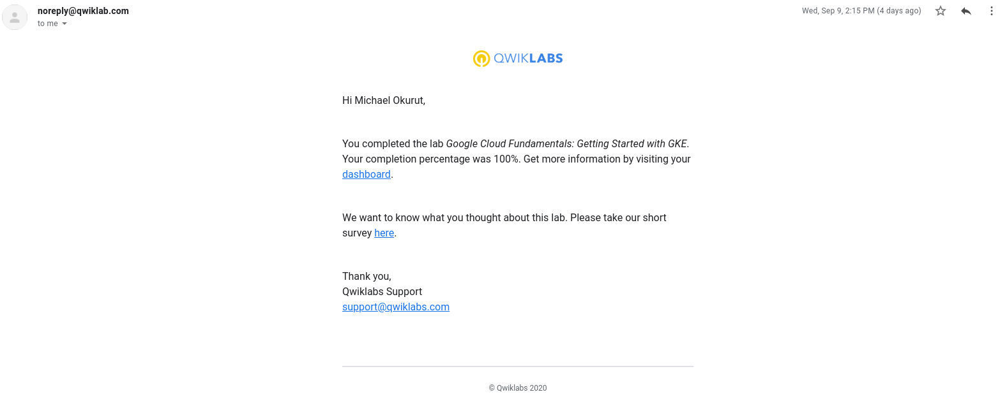

# Screenshots for completed labs.

### 1.Google Cloud Fundamentals: Getting Started with GKE.
  

### 2. AK8S-03 Creating a GKE Cluster via GCP Console.

### 3. Implement Private Google Access and Cloud NAT. 

### 4. VPC Networking. 

### 5. Creating a Streaming Data Pipeline for a Real-Time Dashboard with Dataflow. 

### 6. Automating the development of infrastructure using Terraform.

### 7. Automating the development of deployment infrastructure using Deployment Manager.

### 8. Creating a Streaming Data Pipeline for a Real-Time dashboard with DataFlow.

### 9. Exploring a BigQuery Public Dataset.

### 10. Implement Private Google Access and Cloud NAT.

### 11. Predicting visitor purchases with a classification model with BigQuery ML.

### 12. Recommenting Products using cloud SQL and Spark.

### 13. Virtual Private Networks(VPN).
.png)